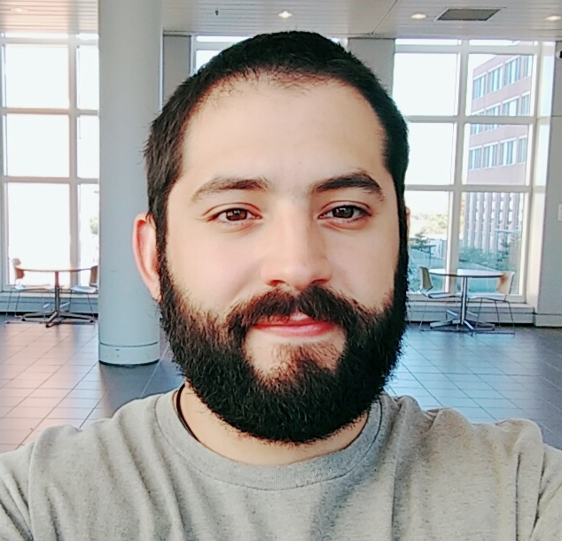

---
<<<<<<< HEAD
title: Alfonso Pepe
>>>>>>>
---
# Alfonso Pepe

Chemist, Biochemist, Ph.D. 

email: pepealfonso22@gmail.com

## Currently

I´m a Postdoctoral fellow in [Biomedical Polymers Division](http://www3.fi.mdp.edu.ar/biomat/?lang=en), INTEMA.  I´m currently working in the synthesis and characterization of electrospun polyurethanes used to coat biomedical devices.

I also have a teaching position in the Chemistry Department of my University. I´m in charge of the Labs and problem solving classes in a Physical Chemistry course (Thermodynamics and quantum mechanics) and in an introductory Chemistry course.

## Skills

**Molecular biology:** cloning and expression, electrophoresis, ELISA, enzymatic activity assays, enzyme kinetics.

**Hemostasis and thrombosis:** in vitro assays to characterize protein extracts and biomaterials (fibrinogenolytic activity, platelet aggregation, coagulation cascade)

**Biomaterials:** synthesis and characterization of polymers

**Informatics:** bioinformatic (phylogenetic trees, MSA, domain search, sequence analysis, etc.), R (statistical analysis, optimization trough response surface methodology, design of experiments), Latex and Python.

## Research interests

Molecular biology, biochemistry, material science.

## Education

#### PhD in Science

2014-2019

Thesis title: "Evaluation of plant proteases as new thrombolytic and antiplatelet compounds"

Universidad Nacional de Mar del Plata, Argentina

#### Industrial disciplines teacher (2 years program)

2014-2015

Universidad Tecnológica Nacional, Argentina

#### Graduate in Chemistry (5 years program)

2008-2013

Universidad Nacional de Mar del Plata, Argentina

Score: 9.14 (out of 10)

#### Graduate in Biochemistry (6 years program)

2008-2013

Universidad Nacional de Mar del Plata, Argentina

Score: 8.97 (out of 10)

## Languages

English. B2 or similar. TOEFL ITP score (2015): 623 (out of 677)

Spanish. Native language.

## Publications

### Papers

Alfonso Pepe; M. Gabriela Guevara; Gustavo A. Abraham; Pablo C. Caracciolo. Surface-modified electrospun poly(carbonate urethane) matrices for improving hemocompatibility response. 
*Sent for publication to Polymer Journal (April 2021). Currently under review.

Florencia Rocio Tito; Alfonso Pepe; Gustavo Raul Daleo, Maria Gabriela Guevara. Optimization of caseinolytic activity of two *Solanum tuberosum* aspartic proteases by response surface methodology. 
*Sent for publication to Journal of Food Engineering (May 2021)*</u>

Tito, F. R., Pepe, A., Tonon, C. V., Daleo, G. R., & Guevara, M. G. (2020). [Determination and characterisation of milk-clotting activity of two Solanum tuberosum aspartic proteases (StAPs).](https://doi.org/10.1016/j.idairyj.2020.104645) *International Dairy Journal*, *104*, 104645.

Rivero, G., Meuter, M., Pepe, A., Guevara, M. G., Boccaccini, A. R., & Abraham, G. A. (2020). [Nanofibrous membranes as smart wound dressings that release antibiotics when an injury is infected](https://doi.org/10.1016/j.colsurfa.2019.124313). *Colloids and Surfaces A: Physicochemical and Engineering Aspects*, *587*, 124313. 

Pepe, A., Tito, F. R., Daleo, G. R., & Guevara, M. G. (2019). [Optimization of fibrinogenolytic activity of Solanum tuberosum subtilisin-like protease (StSBTc-3) by response surface methodology]( https://doi.org/10.1016/j.btre.2019.e00330). *Biotechnology Reports*, *22*, e00330.

Frey, M. E., D'ippólito, S., Pepe, A., Daleo, G. R., & Guevara, M. G. (2018).[Transgenic expression of plant-specific insert of potato aspartic proteases (StAP-PSI) confers enhanced resistance to Botrytis cinerea in Arabidopsis thaliana]( https://doi.org/10.1016/j.phytochem.2018.02.004). *Phytochemistry*, *149*, 1-11.

Suárez-González L, Sanabria-Alba L, García D, et al. [Manifestación inusual de mieloma múltiple activo. Disfibrinogenemia adquirida e inhibidor del factor V](https://www.medigraphic.com/pdfs/hematologia/re-2017/re172f.pdf). Rev Hematol Mex. 2017;18(2):92-98. 

Pepe, A., Frey, M. E., Muñoz, F., Fernández, M. B., Pedraza, A., Galbán, G., ... & Guevara, M. G. (2016). [Fibrin (ogen) olytic and antiplatelet activities of a subtilisin-like protease from Solanum tuberosum (StSBTc-3)](https://doi.org/10.1016/j.biochi.2016.03.015). *Biochimie*, *125*, 163-170.

### Book chapters

PEPE, ALFONSO; TITO, FLORENCIA ROCIO; GUEVARA, MARIA GABRIELA. [Proteases affecting blood coagulation and fibrinolysis from plants. From: Biotechnological applications of plant proteolytic enzymes]( https://www.springer.com/gp/book/9783319971315). Eds: GUEVARA, MARIA GABRIELA; DALEO, GUSTAVO RAÚL. Springer Nature. 2018. p 129 - 141 - . isbn 978-3-319-97132-2_6.

PEPE, ALFONSO; FREY, MARIA EUGENIA; MUÑOZ, FERNANDO; FERNANDEZ, M. BELEN; DALEO, R. GUSTAVO; GUEVARA, M. GABRIELA. [StSBTc-3: una serin proteasa de *Solanum tuberosum* con actividad antiplaquetaria y fibrin(ogen)olítica.](https://ri.conicet.gov.ar/handle/11336/110370) In: Avances y perspectivas en biotecnología y ciencias agropecuarias. Eds: MA. CONCEPCIÓN DE LA CRUZ LEYVA; NICOLÁS GONZÁLEZ CORTÉS; JOSÉ ULISES GONZÁLEZ DE LA CRUZ; TEMANI DURÁN MENDOZA; MARTHA ALICIA PERERA GARCÍA; MARIO ALFREDO BENÍTEZ MANDUJANO. Universidad de San Carlos de Guatemala, Ciudad Universitaria. 2016. p67 - 83. isbn 978-9929-8141-5-8

CECILIA MENDIVE, MARIANO CURTI, ALFONSO PEPE, DETLEF BAHNEMANN, THORSTEN GESING, M. MANGIR MURSHED, THOMAS BREDOW; PAUL COCHRANE, ANDREAS GERDES. Theoretical investigation of bismuth compounds with lone pairs and photocatalytic properties in the visible spectra. Jahresbericht des RRZN-Clustersystems 2011. Leibniz: Leibniz Universitat IT Services (vormals RRZN). 2012. p144 - 145. isbn 978-3-9814539-1-1

## Some congress and conferences

TITO, FLORENCIA ROCIO; PEPE, ALFONSO; TONON, CLAUDIA VIRGINIA; DALEO, GUSTAVO RAUL; GUEVARA, MARIA GABRIELA. Expression and characterization of an aspartic protease from *Solanum tuberosum* in *Kluyveromyces lactis*.  Joint LV Annual SAIB Meeting and XIV PABMB Congress. Salta, Argentina 2019.

PEPE, ALFONSO; GUEVARA, MARÍA GABRIELA, ABRAHAM, GUSTAVO A; CARACCIOLO, PABLO C. Lysine modification of policarbonate-uretane electrospun membranes. Simposio Argentino de Polímeros XIII. Universidad Tecnológica Nacional (UTN). CABA, Argentina 2019.

RIVERO, GUADALUPE; PEPE, ALFONSO; GUEVARA, MARÍA GABRIELA, ABRAHAM, GUSTAVO A. Antibacterial evaluation of electrospun pH sensitive membranes as smart wound dressings. Simposio Argentino de Polímeros XIII. Universidad Tecnológica Nacional (UTN). CABA, Argentina 2019.

PEPE, ALFONSO; TITO, FLORENCIA ROCIO; GUEVARA, MARIA GABRIELA. Optimization of fibrinogenolytic activity of a potato subtilisin by response surface methodology. XIII Congreso Argentino de Hemostasia y Trombosis y IV Curso Educacional de la ISTH. Grupo CAHT. Buenos Aires, Argentina 2018. 

TITO, FLORENCIA ROCIO; TONÓN, CLAUDIA VIRGINIA; PEPE, ALFONSO; DALEO, GUSTAVO RAÚL; GUEVARA, MARIA GABRIELA. Characterization of milk-clotting activity of brewer´s spent grain proteases. LIV Reunión anual Sociedad Argentina de Investigación en Bioquímica y Biología Molecular. Mendoza, Argentina 2018. 

TITO, FLORENCIA ROCIO; PEPE, ALFONSO; TONÓN, CLAUDIA VIRGINIA; DALEO, GUSTAVO RAÚL; GUEVARA, MARIA GABRIELA. Characterization of caseinolytic activity of two *S. tuberosum* aspartic proteases (StAPs). Reunión Conjunta de Sociedades de Biociencias (SAIB). Buenos Aires, Argentina 2017.  

PEPE, ALFONSO; WHITEHEART, SIDNEY W.; DALEO, GUSTAVO RAÚL; GUEVARA, MARIA GABRIELA. Antiplatelet activity of StSBTc-3, a subtilisin-like serine protease of *Solanum tuberosum*. Reunión Conjunta de Sociedades de Biociencias (SAIB). Buenos Aires, Argentina 2017. 

TITO, FLORENCIA; PEPE, ALFONSO; FREY, MARIA EUGENIA; D'IPPÓLITO, SEBASTIAN; DALEO, R. GUSTAVO; GUEVARA, M. GABRIELA. Caseinolytic and milk-clotting activity of *Solanum tuberosum* aspartic proteases (StAPs). 52th Annual Meeting Argentine Society for Biochemistry and Molecular Biology. Mendoza, Argentina 2016. 

PEPE, ALFONSO; WHITEHEART, SIDNEY W.; GUEVARA, M. GABRIELA. Cloning and Expression of a Fibrin(ogen)olytic Serine Protease from *Solanum tuberosum*. 16th Midwest Platelet Conference. The University of Tennessee. Memphis, TN, United States. 2016. 

PEPE, ALFONSO; PEDRAZA, A.B.; FERNANDEZ, M. BELEN; GALBAN, GUSTAVO J.; GUEVARA, M. GABRIELA. Evaluation of haemostatic activity of a serine protease isolated from *S. tuberosum* leaves. 50th Annual Meeting Argentine Society for Biochemistry and Molecular Biology. Mendoza, Argentina 2014. 

PEPE, ALFONSO; CHAME, DAVID; CURTI, MARIANO; IVANOVA, IRINA; TITO, FLORENCIA; BAHNEMANN, DETLEF; GRELA, MARIA ALEJANDRA; MENDIVE, CECILIA B.. Slowing Light: Enhancing the Photocatalytic Activity of Doped TiO2 with Photonic Crystals. Alemania. Bremen. 2013. Libro. Artículo Breve. Workshop. Functional oxides for emerging technologies. CECAM

TOSONI, LEONARDO; PEPE, ALFONSO; CARPINELLA, M. CECILIA; VERA, D. MARIANO. Estudio computacional de la inhibición de HPPD mediante compuestos de origen natural. XXIX Congreso Argentino de Química (AQA). Mar del Plata, Argentina 2012. 

## Grad school courses

Programming in Python,  64 h

Introduction to group theory, 24 h

Solid state chemistry, 24 h

Design of experiments and data analysis in Molecular biology and physiology, 24 h

Introduction to R programing language, 24 h

Topics in mathematical biology, 30 h

Trends in mass spectroscopy, 36 h

Vibrational spectroscopy as tool in the food industry, 24 h

Capillary electrophoresis, 36 h

High performance liquid chromatography, 24 h

Flow cytometry in biochemistry and biology, 40 h

History of science in Argentina, 60 h

Bioinformatics, comparative genomics and molecular evolution, 80 h

Trends in proteomics, 36 h

Teaching chemistry and physics, 24 h

## Fellowships

**Postdoctoral fellowship** granted by CONICET. 2019-2022. Enhancement of hemocompatibility trough surface modification of polyurethane electrospun membranes.

**Fulbright fellowship**. University of Kentucky. 2016. Interaction between platelets and plant proteases.

**Doctoral fellowship**. granted by CONICET. 2014-2019. Evaluation of proteases as new antiplatelet and thrombolytic compounds.

**Fellowship for advanced student**. Universidad Nacional de Mar del Plata. 2012-2013. Computational chemistry to model tyrosinase inhibitor mechanisms.

**Training fellowship for students.** CIC. 2011-2013. Computational simulations on pre-drugs discovered in Argentina. 

## Teaching experience

Teaching Assistant (as graduate) from 2009 to present. Responsible for teaching a Physical Chemistry and Introduction to Chemistry courses. I organize and lead practical hands-on labs and theory-driven problem-solving classes.

Teaching Assistant (as undergraduate) form 2009 to 2014. Several courses through out the graduate program.

### Other teaching experience

Participant of a program at my university designed to provide resources for teachers who work at underprivileged high schools. We develop activities to help teachers bring science closer to their students. Started 2018. Ongoing.

## Awards

Argentinian Chemistry Association Award. Honor mention for top grade during undergraduate program. 2014.

Highest academic average during undergraduate program, Rotary Club Mar del Plata. 2014.

## Other interests

I'm very interested in philosophy. I toke several courses on that subject at my university. Also I enjoy books, bicycles and woodworking. Above all things I love mi little dog Morgana.

